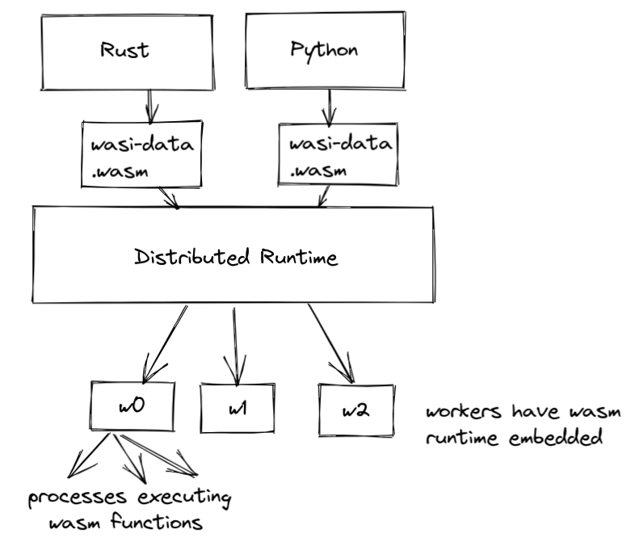

# wasi-data

Support for [embarrassingly parallel](https://en.wikipedia.org/wiki/Embarrassingly_parallel) algorithms and distributed computation for data streams

---

## Problem

* Input data is far beyond gigabyte-scale
* I/O-bound
* Distributed
* Must be resilient

note: The future is distributed

---

## API

```java
DataSet<Row<A,B,C…>>

map(func (Row<A,B,C>) Row<…>)

reduce(Row<out>, func(Row<out>, Row<orig>) Row<out>)
```

---

## map-reduce

Specialization of split-apply-combine

note: map-reduce brings compute to the data. Traditional parallel algorithms bring data to the compute.
note: Only time data is moved, is when all of the parallel workers are communicating their results (step 3)

---




---

## Real world frameworks based on map-reduce

There are so many

note: map-reduce is such a fundamental piece of distributed computation

---

## To name a few

* [Apache Hadoop](https://hadoop.apache.org/)
* [Apache Spark](https://spark.apache.org/)
* [Apache Flink](https://github.com/apache/flink)
* [Timely Dataflow](https://github.com/TimelyDataflow/timely-dataflow)
* [Apache Beam](https://beam.apache.org/)
* ...
* Google Cloud Dataflow
* IBM Streams
* [Twister2](https://twister2.org/)
* ...

---

## Distributed map-reduce

note: Distributed impl's of MapReduce require a means of connecting the processes performing the Map and Reduce phases

Requires an implementation to connect processes performing map and reduce phases.

* Distributed file system
* Distributed database
* Streaming from mappers to reducers
* Sharding

---

## Why WASM and WASI

note: same reasons as everyone else, heterogenous hardware and software, edge, server farms

* Portable
* Host and language-independent
* Reliability and Isolation
* Composable WASM modules
* Highly performant distributed computation (SIMD, hardware acceleration)

---

## Example

```java
createDataSet([
    Row(a=1, b=2., c='string1', d=date(2000, 1, 1)),
    Row(a=2, b=3., c='string2', d=date(2000, 2, 1)),
    Row(a=4, b=5., c='string3', d=date(2000, 3, 1))
])

DataSet<...> input = // [...]
DataSet<...> reduced = input
  .groupBy(/*define key here*/)
  .reduce(/*do something*/);
```
